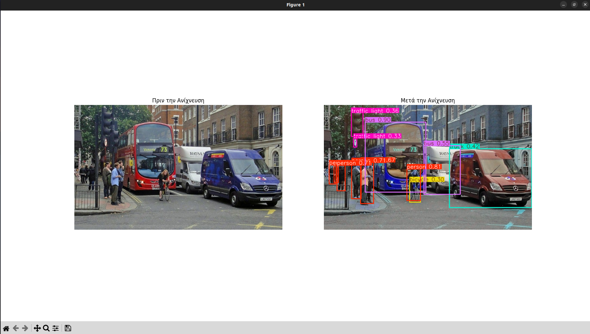
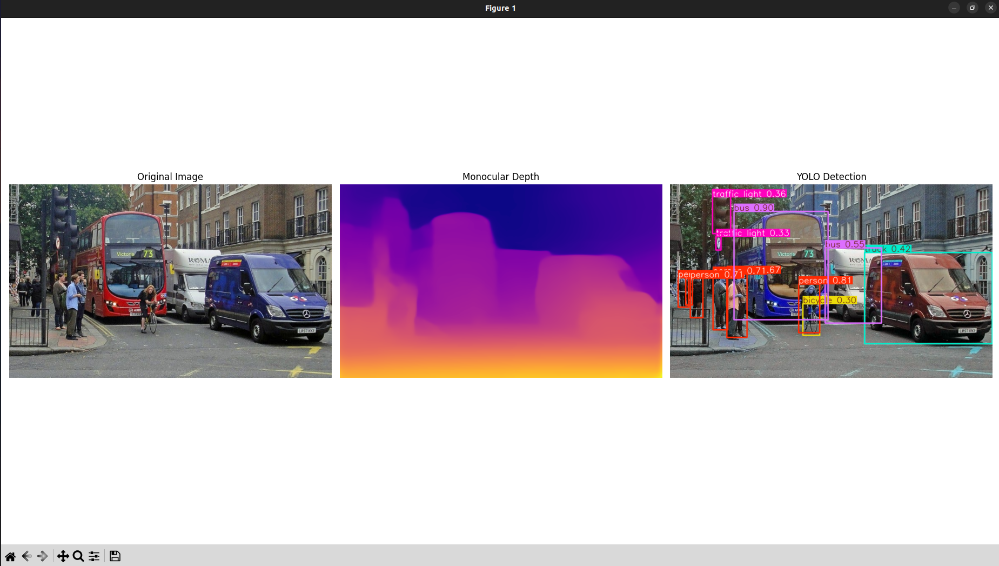
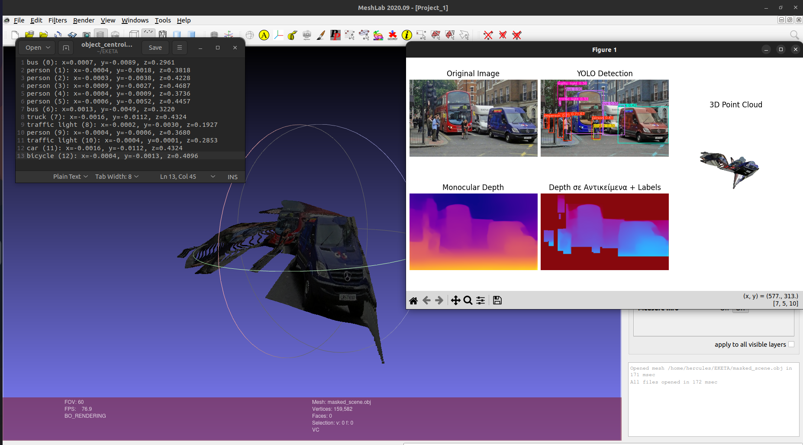
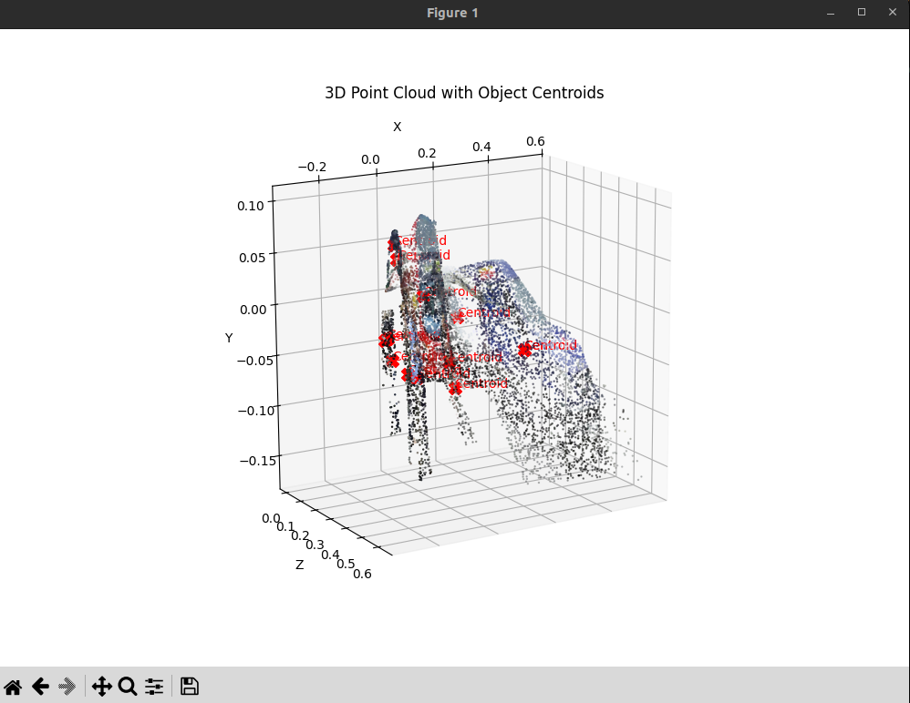

## Ανακατασκευή 3D Σκηνής από Μονοεικόνα με Ανίχνευση Αντικειμένων και Εκτίμηση Βάθους


στο τερματικο γραφω τα εξης :

```
sudo apt update
sudo apt install python3-venv -y
python3 -m venv yolov8env
source yolov8env/bin/activate


pip install --upgrade pip
pip install torch torchvision torchaudio --index-url https://download.pytorch.org/whl/cpu

pip install ultralytics 

```

για να το τρεξω πηγαινουμε στο τρεματικο 

```
source yolov8env/bin/activate 
```

μπαινω στο φακελο που εχω τα αρχεια .py με την εντολη ```cd```
και γραφω :

```
python detect.py
```

  <div style="text-align:center;">
    
</div>


ή  γραφω :
```
python fasi1_detect_depth.py
```

  <div style="text-align:center;">
    
</div>

ή γραφω :

```
python TELIKO_detect_depth_estimatinon.py
```

  <div style="text-align:center;">
    
</div>

επιπλεον δημιουργειται και 3d σκηνη που μεσα σε αυτην εχουν το pointcloud και τοποθετουνται με κοκκινα σημαδια τα κεντρα βαρη


  <div style="text-align:center;">
    
</div>
