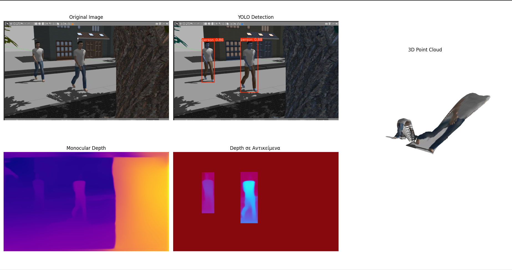
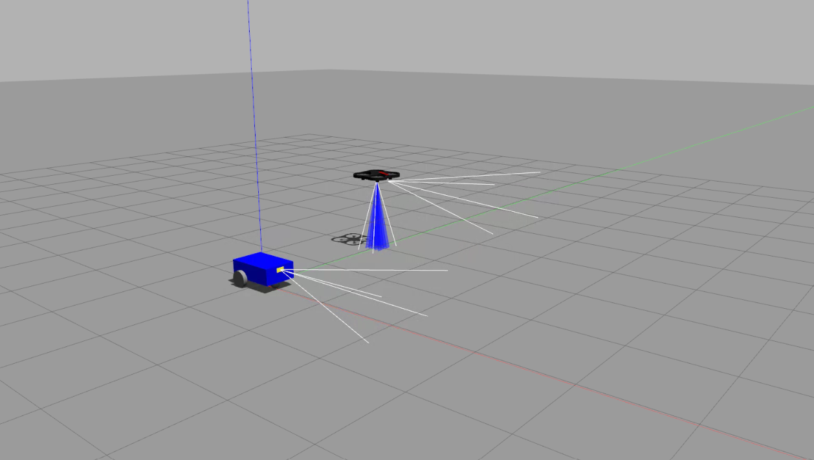

## Ανακατασκευή 3D Σκηνής από Μονοεικόνα με Ανίχνευση Αντικειμένων και Εκτίμηση Βάθους


στο τερματικο γραφω τα εξης :

```
sudo apt update
sudo apt install python3-venv -y
python3 -m venv yolov8env
source yolov8env/bin/activate


pip install --upgrade pip
pip install torch torchvision torchaudio --index-url https://download.pytorch.org/whl/cpu

pip install ultralytics 

```

για να το τρεξω πηγαινουμε στο τρεματικο 

```
source yolov8env/bin/activate 
```

μπαινω στο φακελο που εχω τα αρχεια .py με την εντολη ```cd```
και γραφω :

```
python detect.py
```

  <div style="text-align:center;">
    
</div>


ή  γραφω :
```
python fasi1_detect_depth.py
```

  <div style="text-align:center;">
    
</div>

ή γραφω :

```
python TELIKO_detect_depth_estimatinon.py
```
### Example 1 
<div style="text-align:center;">
    
</div>

### Example 2

  <div style="text-align:center;">
    
</div>

επιπλεον δημιουργειται και 3d σκηνη που μεσα σε αυτην εχουν το pointcloud και τοποθετουνται με κοκκινα σημαδια τα κεντρα βαρη


  <div style="text-align:center;">
    
</div>

## ROS2 with 1 Drone & 1 UGV in Gazebo


Δημιουργια ενος καινουργιου φακελου ``robot_eketa_1uav_1ugv `` οπου μεσα βαζω τον φακελο ```src```

στο τρεμτικο μεσα στον ```robot_eketa_1uav_1ugv``` γραφω :

```shell
colcon build
colcon build --symlink-install
```

μετα   
```shell 
source install/setup.bash
```

και τελος 
```shell
ros2 launch robot_eketa_bringup eketa_gazebo.launch.xml
```
και σε αλλο τερματικο για να κουνηθει το drone

```shell
ros2 run ros2 topic pub -1 /simple_drone/takeoff std_msgs/msg/Empty "{}"
```

και μετα 

```shell
ros2 topic pub -1 /simple_drone/cmd_vel geometry_msgs/msg/Twist "{linear: {z: 1.0}, angular: {z: 0.0}}"
```

ή
```shell
ros2 topic pub -1 /simple_drone/cmd_vel geometry_msgs/msg/Twist "{linear: {z: -1.0}, angular: {z: 0.0}}"
```

και σε αλλο τερματικο για να κουνηθει το UGV
```shell
ros2 topic pub /cmd_vel geometry_msgs/msg/Twist "{linear: {x: 0.5},angular:{z: 0.5}}"
```

  <div style="text-align:center;">
    
</div>

## ROS2 with 2 Drone & 1 UGV in Gazebo

Δημιουργια ενος καινουργιου φακελου ``robot_eketa_2uav_1ugv `` οπου μεσα βαζω τον φακελο ```src```

στο τρεμτικο μεσα στον ```robot_eketa_2uav_1ugv``` γραφω :

```shell
colcon build
colcon build --symlink-install
```

μετα   
```shell 
source install/setup.bash
```

και τελος 
```shell
ros2 launch robot_eketa_bringup 2uav_1ugv_gazebo.launch.xml
```
και σε αλλο τερματικο για να κουνηθει το drone 1

```shell
ros2 run ros2 topic pub -1 /simple_drone/takeoff std_msgs/msg/Empty "{}"
```

και μετα 

```shell
ros2 topic pub -1 /simple_drone/cmd_vel geometry_msgs/msg/Twist "{linear: {z: 1.0}, angular: {z: 0.0}}"
```

ή
```shell
ros2 topic pub -1 /simple_drone/cmd_vel geometry_msgs/msg/Twist "{linear: {z: -1.0}, angular: {z: 0.0}}"
```

και σε αλλο τερματικο για να κουνηθει το drone 2

```shell
ros2 run ros2 topic pub -1 /simple_drone2/takeoff std_msgs/msg/Empty "{}"
```

και μετα 

```shell
ros2 topic pub -1 /simple_drone2/cmd_vel geometry_msgs/msg/Twist "{linear: {z: 1.0}, angular: {z: 0.0}}"
```

ή
```shell
ros2 topic pub -1 /simple_drone2/cmd_vel geometry_msgs/msg/Twist "{linear: {z: -1.0}, angular: {z: 0.0}}"
```

και σε αλλο τερματικο για να κουνηθει το UGV
```shell
ros2 topic pub /cmd_vel geometry_msgs/msg/Twist "{linear: {x: 0.5},angular:{z: 0.5}}"
```
